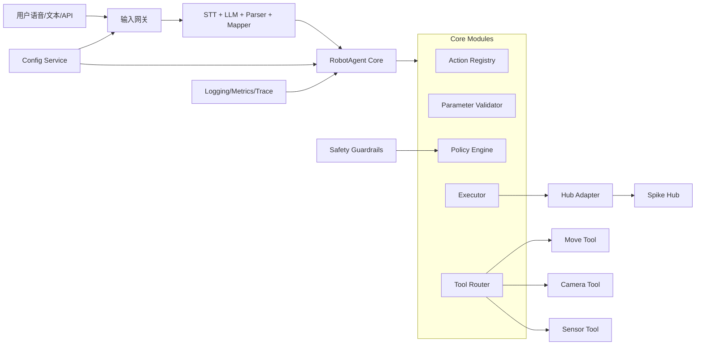
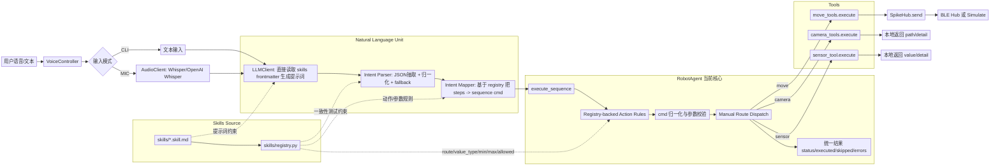
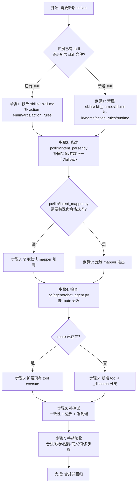

# Voice Robot

一个面向 Spike Hub 的语音/文本机器人控制项目。  
主链路是：用户输入 -> LLM -> 意图解析 -> 命令映射 -> RobotAgent 执行。

## Quickstart

### 1) 环境要求

- Python 3.11+
- Windows/macOS/Linux（当前开发验证以 Windows 为主）
- 可选：Spike Hub 硬件（无硬件也可用 simulate 模式）

### 2) 安装依赖

推荐方式 A（uv）：

```bash
uv sync
```

方式 B（venv + pip）：

```bash
python -m venv .venv
.venv\Scripts\activate
pip install -r requirements.txt
```

### 3) 可选配置

在项目根目录创建 `.env`（可选）：

```env
OPENAI_API_KEY=your_key
```

说明：

- 若有可用 LLM（OpenAI 或本地扩展的 ollama 客户端），系统会走 LLM 生成 JSON。
- 若无可用 LLM，仍可输入简单动作文本，解析器会用 fallback 规则尽量解析。

### 4) 启动项目（最快上手）

直接运行：

```bash
python pc/voice_to_command.py
```

默认是：

- `spike_simulation=True`（不连接 BLE，适合本地调试）
- `mode='cli'`（命令行输入）
- `run_once=False`（持续循环）

你可以在终端输入示例：

- `向前30cm，然后左转60度`
- `camera photo`
- `sensor distance`
- `stop`

### 5) 运行测试

```bash
python -m unittest tests.test_robot_agent tests.test_intent_parser_registry_consistency
```

## 项目目标（To-Be）

最终目标是把 RobotAgent 做成唯一执行中枢，输入层、NLU 层和工具层都围绕统一契约工作。



目标能力包括：

1. RobotAgent 唯一执行入口。
2. Skills 成为动作和参数的单一真相源。
3. 可配置策略（continue/fail_fast、边界策略）。
4. 可观测能力（结构化日志、指标、关键链路追踪）。
5. 完整自动化回归与 CI。

## 目前项目的样子（As-Is）

当前链路已经可用，核心执行入口已经统一到 RobotAgent。




### 当前完成度（含实测）

结论先说：离“目标架构完整体”还没到“差不多完成”；离“可用 MVP”已经比较接近。

已确认结果（2026-07-05）：

1. `tests/test_intent_parser_registry_consistency.py` 通过（6/6）。
2. `tests/test_robot_agent.py` 通过（5/5）。
3. 主链路已可运行：输入 -> LLM -> parser -> mapper -> RobotAgent -> tools/hub。

按目标架构分项评估：

1. 执行中枢（RobotAgent 单入口）：高，约 85%。
2. Skills 作为规则源（registry 驱动 mapper/agent）：高，约 80%。
3. Tool Router 工具分发：中高，约 75%（仍是手写 route 分支，未完全 runtime 动态化）。
4. camera/sensor 真实能力：中，约 55%（存在 dry_run、未实现分支）。
5. Hub Adapter 工程化能力（重试/超时/状态观测）：中低，约 45%。
6. Config Service（robot.yaml 生效）：低，约 10%（配置文件目前为空且未接入主流程）。
7. 可观测（结构化日志/指标/trace）：低，约 20%。
8. Policy Engine 与 Safety Guardrails：低，约 30%。
9. 自动化 CI：低，约 10%（未见 CI workflow）。

综合估计：当前大约在 68% 到 75% 区间。

这意味着：

1. 功能链路层面：已经“可用且稳定”。
2. 工程化目标层面：还有一段明显差距，主要在配置、可观测、策略、CI。

### 与目标的最小差距清单

如果要更接近 To-Be（不是只可用，而是可维护可演进），优先补这 4 项：

1. 把 `runtime` 从声明字段升级为真实动态路由（减少 RobotAgent 手写分支）。
2. 接入 `pc/config/robot.yaml`（模型、超时、fail_mode、simulate 开关统一配置化）。
3. 增加结构化日志与关键指标（至少覆盖 parser/mapper/agent/tool/hub 各阶段）。
4. 增加 CI（最少自动跑现有 2 组测试）。

## 历史整理（从规划到现在）

### 阶段 0：早期链路

- 存在多处执行入口，文档与代码容易漂移。

### 阶段 1：单链路收敛

- 明确主链路：输入 -> LLM -> parser -> mapper -> RobotAgent -> hub。
- `RobotAgent.execute_sequence` 成为统一执行入口。

### 阶段 2：skills 驱动增强

- skills frontmatter 接入 LLM 提示词。
- registry 提供动作规则给 intent_mapper 与 RobotAgent。
- 增加一致性测试，减少 parser/mapper/agent 漂移。

### 阶段 3：当前状态

- 核心功能可用。
- 工程化能力仍在建设中（配置、观测、策略、CI）。

## 项目详细介绍

### 1) 输入与编排层

- `pc/voice_to_command.py`
- 职责：采集输入（CLI/mic），调用 LLM，解析意图，映射命令，委托 RobotAgent 执行。

### 2) NLU 层

- `pc/llm/llm_client.py`
  - 读取 `skills/*.skill.md` frontmatter 构建提示词。
  - 统一 LLM 调用与 fallback。
- `pc/llm/intent_parser.py`
  - 从模型输出提取 JSON，做动作归一化与文本 fallback。
- `pc/llm/intent_mapper.py`
  - 基于 skills registry 把 `steps` 映射为 `sequence` 命令。

### 3) 执行层

- `pc/agent/robot_agent.py`
  - 加载动作规则。
  - 归一化并校验命令（类型、范围、枚举）。
  - 按 `route` 分发到工具层。
  - 统一返回 `status/executed/skipped/errors`。

### 4) 工具层

- `pc/tools/move_tools.py`
  - move/gripper 动作统一入口 `execute(args)`。
- `pc/tools/camera_tools.py`
  - `camera photo` 可走 dry_run 或本地摄像头。
  - `video` 当前未实现。
- `pc/tools/sensor_tool.py`
  - `distance` 支持 dry_run 模拟值。
  - `color/gyro` 当前未实现。

### 5) 通信层

- `pc/spike_communication/spikehub.py`
- 支持 BLE 连接和 simulate 模式，提供 `send(cmd)` 接口。

### 6) 技能与规则层

- `skills/*.skill.md`
- `skills/registry.py` 负责加载 frontmatter 并转为 `ActionRule`。

## Skill 文档说明（为什么用这些字段）

skills 文件是“可读文档 + 可执行规则”的结合体。

### 整体数据流（从 skill 到执行）

1. 加载 skills frontmatter  
在 [skills/registry.py](skills/registry.py#L57) 中，遍历 `skills/*.skill.md`，读取 frontmatter 并合并动作规则。
2. action_rules 转为运行时规则对象  
在 [skills/registry.py](skills/registry.py#L75) 中，把每条规则转成 `ActionRule`，统一包含 `route/value_type/arg_key/allowed/min/max`。
3. 映射阶段按规则拼命令  
在 [pc/llm/intent_mapper.py](pc/llm/intent_mapper.py#L53) 中，依据动作规则把 `steps` 转成 `sequence` 命令字符串。
4. 执行前按同一规则再做强校验  
在 [pc/agent/robot_agent.py](pc/agent/robot_agent.py#L136) 中，按 `value_type`、范围和枚举再次校验后才分发执行。

这就是为什么这些字段不是“重复定义”，而是“同一规则在生成阶段和执行阶段复用”：

1. 生成端（mapper）用它来规范输出命令格式。
2. 执行端（agent）用它来阻止非法参数和越界值。
3. 两端共享同一来源，能显著降低规则漂移。

### 每个 skill 文件在系统里的角色

1. [skills/base.skill.md](skills/base.skill.md#L1)  
全局输出契约。它约束 LLM 输出必须是 `steps` 结构，强调 JSON-only，不绑定具体动作类别。
2. [skills/move.skill.md](skills/move.skill.md#L1)  
移动/转向/夹爪动作定义。给出动作枚举、角度/距离参数范围，以及 move 路由规则。
3. [skills/camera.skill.md](skills/camera.skill.md#L1)  
相机动作定义。约束 `camera` 的参数 `mode` 只能是 `photo|video`。
4. [skills/sensor.skill.md](skills/sensor.skill.md#L1)  
传感器动作定义。约束 `sensor` 的参数 `name` 只能是 `distance|color|gyro`。

从职责分工看：

1. `base.skill.md` 负责“全局输出格式”。
2. 其他技能文件负责“具体动作和参数语义”。
3. registry 负责“加载并结构化”。
4. mapper/agent 负责“消费同一套规则”。

这是一种“文档即规则（Docs as Rules）”设计：既能被人阅读，也能被代码直接执行和校验。

### 核心字段

1. `id`：技能唯一标识，用于来源追踪。
2. `name`/`description`：人类可读信息，用于文档和提示词语义。
3. `triggers`：自然语言触发线索，增强 LLM 理解。
4. `input_schema`：声明输入动作与参数结构。
5. `output_schema`：声明工具输出结构。
6. `action_rules`：运行时关键规则。
7. `runtime`：工具实现入口标识（当前主要用于声明和对齐）。
8. `examples`：给 LLM 和维护者的样例。
9. `version`：规范版本。

### action_rules 子字段（最关键）

1. `route`：决定分发到哪个工具（move/camera/sensor）。
2. `value_type`：参数类型约束（none/int/str）。
3. `arg_key`：从 `args` 中取值的键名。
4. `allowed`：字符串参数白名单。
5. `min`/`max`：数值参数边界。

这套字段让 LLM 输出约束、命令映射和执行校验共享同一套规则，避免多处硬编码。

## 如何新增一个新的指令（Action）

先看总流程图（建议按图从上到下执行）：



### A) 在已有技能里新增 action（推荐）

下面给你一套从 0 到可运行的完整步骤。  
示例目标：新增动作 `beep`，让机器人执行蜂鸣或提示音。

### 步骤 0：先定义指令契约

先确定 4 个关键点：

1. `action` 名称：例如 `beep`
2. `route`：复用已有 route（如 `move`）还是新增 route（如 `audio`）
3. 参数类型：`none` / `int` / `str`
4. 参数约束：`arg_key`、`allowed`、`min/max`

如果这 4 项没先定清楚，后面很容易出现 parser/agent 不一致。

### 步骤 1：在 skill 文件里注册新动作

在对应 skill 的 frontmatter 里同时改 3 处：

1. `input_schema.properties.action.enum` 加上新 action
2. `input_schema` 的参数约束补齐（required/enum/range）
3. `action_rules` 新增该 action 规则

示例（片段）：

```yaml
action_rules:
  beep:
    route: move
    value_type: int
    arg_key: duration_ms
    min: 50
    max: 3000
```

说明：

1. `skills/registry.py` 会自动读取新规则，不需要改 registry 逻辑。
2. 若你是新增全新技能文件，也记得补 `id/name/description/version/examples`。

### 步骤 2：让 parser 认识这个新动作

当前 parser 是“半动态”：规则来自 skill，但动作归一化逻辑仍有硬编码分支。  
所以新增 action 时通常要改 `pc/llm/intent_parser.py`：

1. 在 `_normalize_action` 增加同义词映射（例如 `beep`、`提示音`）。
2. 在 `_normalize_step` 增加该 action 的参数归一化分支。
3. 若希望无 JSON/fallback 文本也能识别，再补 `_fallback_steps_from_text`。

建议原则：

1. 所有输出都收敛为 `{"action": "...", "args": {...}}`。
2. 参数键名必须与 `action_rules.arg_key` 一致。

### 步骤 3：确认 mapper 是否需要改

`pc/llm/intent_mapper.py` 大多数情况下不需要改：

1. 它会通过 registry 读取 `value_type/arg_key/allowed` 自动映射。
2. 只有当你希望输出特殊 cmd 格式时，才需要加定制逻辑。

### 步骤 4：接入执行分发（RobotAgent）

检查 `pc/agent/robot_agent.py` 两件事：

1. 如果新 action 的 `route` 是已有值（move/camera/sensor），确认对应工具支持该 action。
2. 如果是新 route（如 `audio`），要在 `_dispatch` 新增 route 分支。

示例（伪代码）：

```python
if route == "audio":
  return await audio_tools.execute({"action": action, "value": value})
```

### 步骤 5：实现或扩展工具层

在目标工具里补 `execute(args)` 对新 action 的处理：

1. 校验参数合法性（再次兜底）
2. 调用硬件/模拟逻辑
3. 统一返回结构：
  - 成功：`{"status": "ok", "detail": "..."}`
  - 失败：`{"status": "error", "detail": "..."}`

### 步骤 6：补测试（强烈建议）

至少补 3 类测试：

1. parser 与 registry 一致性：
  - 参考 `tests/test_intent_parser_registry_consistency.py`
2. agent 执行与参数边界：
  - 参考 `tests/test_robot_agent.py`
3. 新动作的端到端最小用例：
  - `input_text -> intent -> sequence -> execute_result`

### 步骤 7：手动验收清单

建议至少跑以下场景：

1. 合法输入（应执行成功）
2. 缺参输入（应被 skip 或报错）
3. 越界输入（应被边界校验拦截）
4. 同义词输入（应归一化到目标 action）
5. 多步骤输入（顺序执行、统计正确）

### 常见坑

1. `action_rules.arg_key` 与 parser 输出参数键不一致。
2. skill 里加了 action，但 `_normalize_action` 没加别名，导致被丢弃。
3. route 新增了，但 `_dispatch` 没有分支。
4. 工具层返回结构不统一，导致 RobotAgent 统计异常。
5. 只改了文档没补测试，后续重构容易回归。

### B) 如果是新增一个完整技能（lights 示例）

下面以新增 `lights` 技能为例。

### 步骤 1：新增 skill 文件

在 `skills/` 下新增 `lights.skill.md`，frontmatter 示意：

```markdown
---
id: lights
name: Lights
description: "灯光控制"
triggers:
  - 灯
  - 灯光
permissions: low
input_schema:
  type: object
  properties:
    action:
      type: string
      enum: [lights]
    args:
      type: object
      properties:
        mode:
          type: string
          enum: [on, off]
      required: [mode]
      additionalProperties: false
  required: [action, args]
action_rules:
  lights:
    route: lights
    value_type: str
    arg_key: mode
    allowed: [on, off]
runtime: pc.tools.lights_tool:execute
version: "1.0"
---
```

### 步骤 2：实现工具入口

新增 `pc/tools/lights_tool.py`，实现统一签名：

```python
async def execute(args: dict) -> dict:
    ...
```

返回建议对齐现有风格：

- 成功：`{"status": "ok", "detail": "..."}`
- 失败：`{"status": "error", "detail": "..."}`

### 步骤 3：接入 RobotAgent 分发

当前 `robot_agent.py` 仍是手写 route 分支。  
若新增 `route: lights`，需要在 `_dispatch` 中补对应分支。

### 步骤 4：按需补 parser fallback 同义词

如果希望在无 LLM 或弱 LLM 场景下依旧识别自然语言，补充 `intent_parser` 的动作同义词和 fallback 规则。

### 步骤 5：补测试

至少补两类：

1. registry/mapper 一致性测试（动作可被规则识别）。
2. RobotAgent 执行测试（合法、非法、越界场景）。

## 开发建议与后续路线

建议优先顺序：

1. 把 `runtime` 变成真实动态路由，减少 RobotAgent 手写分支。
2. 引入配置中心（`pc/config/robot.yaml`）并真正接入运行参数。
3. 补齐可观测（结构化日志 + 关键指标）。
4. 增加 CI，固定回归命令。

## 目录参考

```text
pc/
  voice_to_command.py       # 主编排入口
  agent/robot_agent.py      # 统一执行中枢
  llm/                      # LLM + parser + mapper
  tools/                    # move/camera/sensor 工具实现
  spike_communication/      # SpikeHub 通信
skills/
  *.skill.md                # 技能声明（frontmatter）
tests/
  test_robot_agent.py
  test_intent_parser_registry_consistency.py
```
