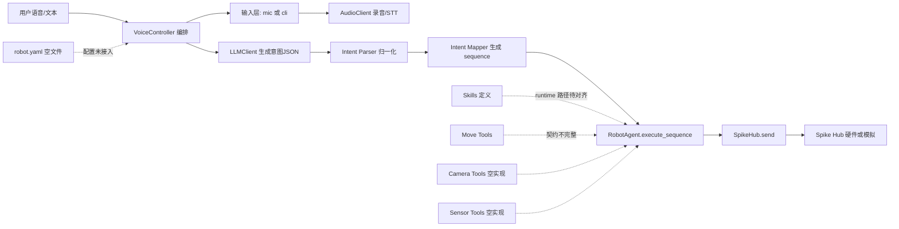
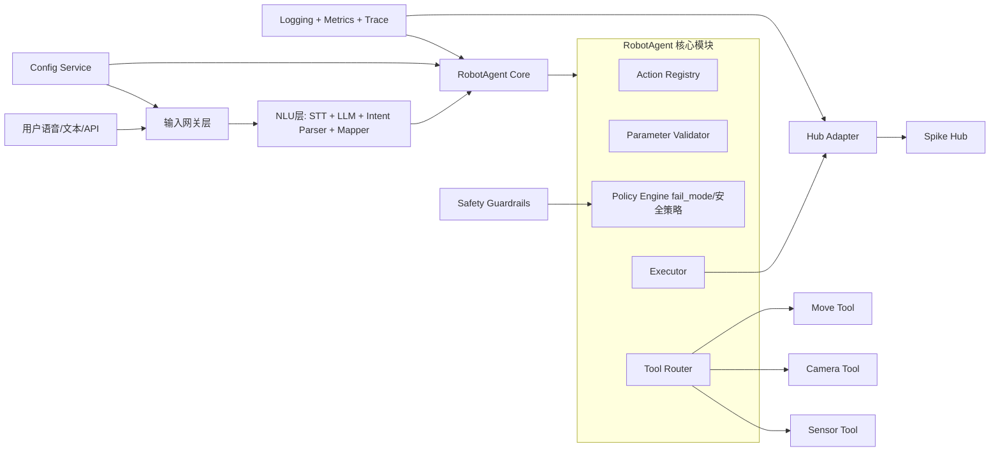
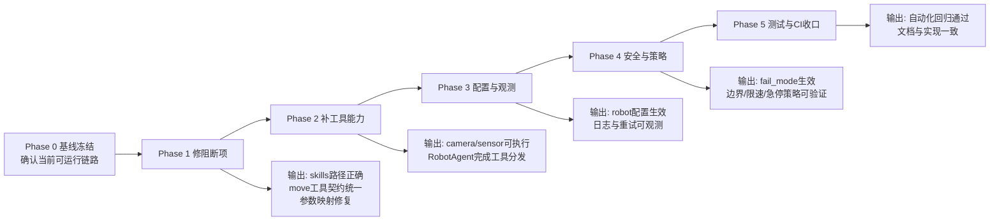
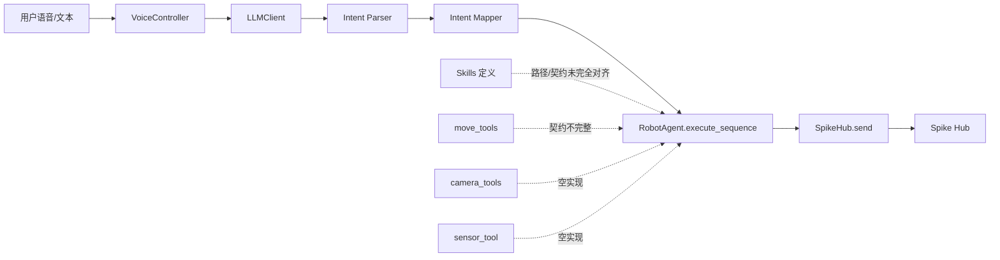
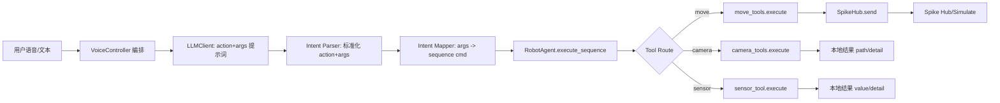
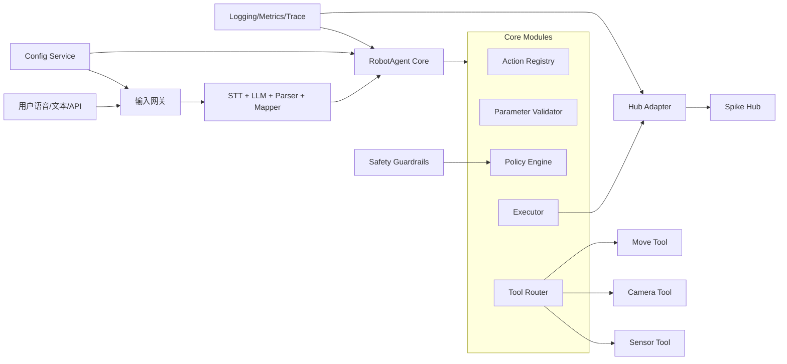
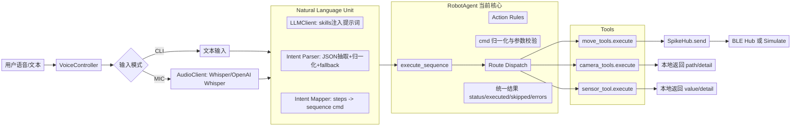

## Plan: RobotAgent 从零搭建方案

目标是把执行职责完全迁入 RobotAgent：主程序只做输入采集、LLM 调用、意图解析与映射，RobotAgent 成为唯一执行入口。你已明确不保留旧兼容链路，因此本方案默认移除 handle_user_text。

**Steps**
1. Phase A：定义单链路边界  
主链路固定为 输入 -> LLM -> intent_parser -> intent_mapper -> RobotAgent.execute_sequence -> hub，下游执行只允许 RobotAgent 入口。
2. 在 robot_agent.py 增加 execute_sequence(seq_spec) 作为唯一执行入口。  
输入契约直接消费 intent_mapper 产出的 sequence。
3. 在 robot_agent.py 定义统一执行结果结构。  
至少包含 status、executed、skipped、errors，便于主程序打印与后续日志。
4. Phase B：在 Agent 层统一动作词典与参数规则  
在 robot_agent.py 维护 action registry，集中定义 action 名、hub 方法名、参数键、参数范围、是否必填。
5. 在 robot_agent.py 增加命令归一化与校验流程。  
对每个 sequence item 做 cmd 解析、action 白名单校验、参数类型和范围校验。
6. 在 robot_agent.py 增加统一分发执行器。  
通过动作词典调用 hub 对应方法；非法动作或参数不抛崩溃，记录 skipped/errors。
7. Phase C：主程序接入 Agent  
在 voice_to_command.py 初始化 RobotAgent(hub, llm_client)。
8. 在 voice_to_command.py 的 run_once 中，用 robot_agent.execute_sequence(seq) 替换本地执行。
9. 在 voice_to_command.py 删除当前本地 execute_sequence 方法。
10. Phase D：删除旧链路并统一 skills 方向  
在 robot_agent.py 删除 handle_user_text 分支及 parse_skill/generate 兼容路径，避免双入口长期并存。
11. 修正 skills runtime 路径，和当前项目结构对齐。  
把 move.skill.md、camera.skill.md、sensor.skill.md 的 runtime 从 tools.xxx 调整为 pc.tools.xxx。
12. 补齐工具层统一入口规范。  
move_tools.py 补齐 execute(args)；camera_tools.py 与 sensor_tool.py 当前为空，按同样契约实现。
13. Phase E：验证与回归  
先在 simulate 模式验证流程和错误路径，再接真实 hub 验证动作安全边界。

**Relevant files**
- robot_agent.py — 新增统一执行入口、动作词典、参数规则、分发与错误回传；移除旧 handle_user_text。
- voice_to_command.py — 删除本地执行函数，改为委托 RobotAgent。
- intent_mapper.py — 保持输出契约稳定，确保 sequence 格式一致。
- move.skill.md — runtime 路径修正。
- camera.skill.md — runtime 路径修正。
- sensor.skill.md — runtime 路径修正。
- move_tools.py — 补齐 execute(args) 统一入口。
- camera_tools.py — 从空文件补齐工具实现。
- sensor_tool.py — 从空文件补齐工具实现。

**Verification**
1. CLI 单步动作：确认由 RobotAgent.execute_sequence 执行，主程序不再直接 hub.send。
2. 多步动作：确认按序执行，executed/skipped 统计正确。
3. 非法动作与越界参数：确认被拦截并记录，不导致主程序中断。
4. simulate 模式全链路：确认无硬件下可跑通。
5. 真实 hub 冒烟：forward、left、right、stop 与既有行为一致。

**Decisions**
- Included：RobotAgent 成为唯一执行入口。
- Included：动作词典和参数规则统一在 Agent 层。
- Included：删除 handle_user_text 旧链路，从单链路重新搭建。
- Excluded：本轮不重做 parser/mapper 算法，只保证契约稳定。

**Further Considerations**
1. 接入节奏建议  
Option A：先只接 move 动作打通主链路，再接 camera/sensor。  
Option B：三类技能一次接齐，但要先实现两个空工具文件。
2. 参数策略建议  
Option A：越界即拒绝并 skip。  
Option B：自动裁剪到边界后执行，并记录裁剪日志。
3. 失败策略建议  
Option A：单步失败继续后续步骤。  
Option B：任一步失败即停止序列，适合高风险动作。

**1) 当前项目总览（As-Is）**

**当前各部分已实现功能**
1. 主流程编排  
voice_to_command.py  
功能：采集输入、调用 LLM、解析意图、映射命令、委托 RobotAgent 执行。  
现状：主链路已可跑通。

1. 语音输入与转写  
audio_utils.py  
功能：录音、Whisper/OpenAI Whisper 转写、TTS。  
现状：可用，支持 mic push-to-talk。

1. LLM 调用层  
llm_client.py  
功能：构造 prompt，本地 Ollama 优先，失败回退 OpenAI。  
现状：可用，但存在模型硬编码问题（未完全按传入 model 执行）。

1. 意图解析  
intent_parser.py  
功能：JSON 抽取、动作归一化、fallback 文本解析。  
现状：可用，但 gripper_pos 参数处理有丢失风险。

1. 意图映射  
intent_mapper.py  
功能：steps 转 sequence 命令。  
现状：基础动作可用；camera/sensor/部分带参动作映射不完整。

1. 执行核心  
robot_agent.py  
功能：动作白名单、参数范围校验、序列执行、统一结果结构。  
现状：是当前唯一执行入口，基础架构正确。

1. 硬件通信  
spikehub.py  
功能：BLE 连接、ready 事件、send、simulate 模式。  
现状：可用，缺少更完整超时重试与观测能力。

1. 工具层  
move_tools.py  
功能：目前只有少量 move 函数，且契约不统一。  
现状：需补 execute 统一入口和动作覆盖。  
camera_tools.py、sensor_tool.py  
现状：空实现。

1. 技能定义层  
move.skill.md、camera.skill.md、sensor.skill.md  
功能：声明触发词、schema、runtime。  
现状：runtime 指向与当前包结构不一致。

1.  配置与测试  
robot.yaml  
现状：空文件。  
测试目录当前缺失，自动回归不足。

---

**2) 目标 RobotAgent 项目总览（To-Be）**

**目标项目每部分要实现的功能**
1. 输入网关层  
功能：统一接入 mic、cli、未来 API；标准化请求对象与上下文。

2. NLU 层  
功能：把自然语言稳定转成结构化 steps；约束输出 schema；提供 fallback。

3. RobotAgent Core  
功能：唯一执行入口；统一动作注册、参数校验、失败策略、结果结构。

4. Tool Router + Tool 实现  
功能：把 camera/sensor/move 这类非 Hub 原生命令路由到工具层，统一 execute 契约与返回结构。

5. Hub Adapter  
功能：隔离 BLE 协议细节；提供连接管理、重试、超时、状态管理。

6. Policy Engine 与 Safety  
功能：支持 continue/fail_fast；强制边界与限速；异常时可触发紧急 stop。

7. 配置与可观测  
功能：集中配置（模型、阈值、超时）；结构化日志、指标、trace，支持排错与复盘。

8. 测试与 CI  
功能：单元测试 + 模拟集成测试 + 自动化回归，避免迭代回退。

---

**3) 从当前架构迁移到 RobotAgent 架构（Migration Flowchart）**

**迁移实施要点（简版）**
1. 先做 Phase 1，不要并行改太多层，先保证“同样输入得到更稳定输出”。  
2. Phase 2 完成后再推进配置和策略，否则会在空工具层上反复返工。  
3. 每个 Phase 必须有可重复验收用例（simulate 优先，再上真实硬件）。  
4. 以 RobotAgent 为唯一执行中枢，不再新增旁路执行逻辑。

我已经把这版架构视图摘要同步到会话计划。如果你要，我下一步可以直接给你一版“Phase 1 的逐文件改造清单（按文件到函数级别）”。

**第一版（你最初链路）**

**当前程序（按你现在代码）**

**目标架构（README To-Be）**

**对比结论（你现在进度）**
1. 主链路打通程度：高  
状态：已完成  
依据：voice_to_command.py, robot_agent.py

2. Tool Router 落地：高  
状态：已完成第一版  
依据：robot_agent.py 已按 route 分发 move/camera/sensor

3. move/camera/sensor 工具可调用：中高  
状态：已完成  
依据：move_tools.py, camera_tools.py, sensor_tool.py

4. 新 schema（action+args）对齐：中高  
状态：基本完成  
依据：llm_client.py, intent_parser.py, intent_mapper.py

5. 配置中心、可观测、安全策略、测试：低  
状态：未完成或部分  
缺口文件：robot.yaml（仍未成为运行主配置），缺日志/指标模块，缺测试目录与 CI

6. 通信可靠性（超时/重试）：中低  
状态：未完成  
依据：spikehub.py 目前仍是基础 send 等待流程

7. 技能文档与当前执行契约一致性：中低  
状态：未完全对齐  
依据：move.skill.md 等仍偏旧语义（例如 action 示例与当前 action+args 有偏差）

**总体进度评估**
1. 按你 README 迁移路线看：约 65% 到 72%  
2. 你已经从“第一版串行链路”进入“目标架构雏形”，但还没到“可观测+可配置+可回归测试”的工程化阶段

如果你愿意，我下一步可以给你一份“差距最小化清单（只做 5 个改动）”，把当前版快速推近目标架构。

你可以把 skills 文件变成三种能力来源，建议按这个顺序做。

先做单一真相源（最小改动）

目标：让 move.skill.md、camera.skill.md、sensor.skill.md 成为动作和参数定义源。

做法：在启动时读取 skills frontmatter，生成一份内存里的 action 列表与参数规则。

接入点：把这份规则传给 llm_client.py 的提示词构建，替代手写动作清单。

收益：以后新增动作只改 skill 文件，不改 prompt 文本。

再做执行层接入（真正运行时使用）

目标：让 RobotAgent 根据 skills 的 runtime 自动路由。

做法：从 runtime 字段读取工具路径，比如 pc.tools.move_tools:execute，构建 route_handlers。

接入点：替换 robot_agent.py 里硬编码分发分支，改为查 skills 注册表执行。

收益：动作新增或迁移工具实现时，不用改 RobotAgent 主逻辑。

最后做一致性校验（防回归）

目标：避免 llm、parser、mapper、agent 与 skills 漂移。

做法：在启动或测试时做校验，检查 action、参数键、枚举值是否一致。

接入点：校验 intent_parser.py、intent_mapper.py、robot_agent.py 与 skills 注册表。

收益：你现在这种“文档写了但代码没真正用”的问题会消失。

你现在最适合的落地路线（2步）

先做“读取 skills 并驱动 llm prompt”，不动执行逻辑。
再做“RobotAgent 从 skills runtime 路由”。
为什么这样分步最稳

风险小，不会一下子改动执行核心。
能立刻看到 skills 参与主链路（LLM 输出会先对齐）。
第二步再改执行分发时，行为更可控。

        """
        把自然语言指令转换为严格 JSON。
        只允许输出一个 JSON 对象，不要 markdown，不要解释。
        支持多步骤动作。
        """
        schema = """
        你是机器人动作解析器。把用户输入转换为严格 JSON。

        只允许输出如下结构（且必须是合法 JSON）：
        {
        "steps": [
            { "action": "forward", "args": { "distance_cm": 30 } },
            { "action": "camera",  "args": { "mode": "photo" } },
            { "action": "sensor",  "args": { "name": "distance" } }
        ]
        }

        硬性规则：
        1) 只输出 JSON，不要代码块，不要解释文本。
        2) 顶层必须有 steps，且 steps 是数组。
        3) 每个 step 只能有两个键：action 和 args。
        4) action 只能是：
        forward, backward, straightforward, straightbackward,
        left, right, face_to, stop,
        gripper_up, gripper_down, gripper_pos,
        camera, sensor。
        5) args 规则：
        - forward/backward/straightforward/straightbackward: {"distance_cm": number}
        - left/right/face_to/gripper_pos: {"angle_deg": number}
        - stop/gripper_up/gripper_down: {}
        - camera: {"mode": "photo"|"video"}
        - sensor: {"name": "distance"|"color"|"gyro"}
        1) 若用户说“先A再B”，必须拆成多个 step，按顺序输出。
        2) 无法识别时返回：{"steps":[]}

        示例1：
        用户输入：向前走30cm，然后左转90度，抓手转到45度
        输出：
        {"steps":[
        {"action":"forward","args":{"distance_cm":30}},
        {"action":"left","args":{"angle_deg":90}},
        {"action":"gripper_pos","args":{"angle_deg":45}}
        ]}

        示例2：
        用户输入：拍一张照片，然后读取距离传感器
        输出：
        {"steps":[
        {"action":"camera","args":{"mode":"photo"}},
        {"action":"sensor","args":{"name":"distance"}}
        ]}
        """

**目标 Mermaid（你 README 的 To-Be）**
~~~mermaid
flowchart LR
    U[用户语音/文本/API] --> GW[输入网关层]
    GW --> NLU[STT + LLM + Parser + Mapper]
    NLU --> CORE[RobotAgent Core]

    subgraph COREMOD[Core Modules]
      AR[Action Registry]
      PV[Parameter Validator]
      PE[Policy Engine]
      TR[Tool Router]
      EX[Executor]
    end

    CORE --> COREMOD
    EX --> HA[Hub Adapter]
    HA --> HUB[Spike Hub]

    TR --> MV[Move Tool]
    TR --> CAM[Camera Tool]
    TR --> SEN[Sensor Tool]

    CFG[Config Service] --> GW
    CFG --> CORE
    OBS[Logging/Metrics/Trace] --> CORE
    OBS --> HA
    SAFE[Safety Guardrails] --> PE
~~~

**差距 Mermaid（Delta）**
~~~mermaid
flowchart TD
    A[已完成] --> A1[主链路: 输入->LLM->Parser->Mapper->RobotAgent]
    A --> A2[RobotAgent 单入口执行+结果结构]
    A --> A3[move/camera/sensor 基础路由与工具调用]
    A --> A4[skills 已注入 LLM 提示词]

    B[部分完成] --> B1[Hub 适配层: 有 SpikeHub, 但可靠性能力有限]
    B --> B2[Tool 能力: camera/sensor 仍以 dry_run/未实现为主]
    B --> B3[策略: 有参数边界, 但无可配置 fail_mode 策略引擎]

    C[未完成] --> C1[Config Service 落地: robot.yaml 为空]
    C --> C2[可观测: 结构化日志/metrics/trace 缺失]
    C --> C3[Safety Guardrails 专项机制缺失]
    C --> C4[自动化测试与 CI 基本缺失]
~~~

**和目标差多少（估算）**
1. 主链路与执行中枢：85%  
2. Tool Router 与工具接入：70%  
3. Hub Adapter 工程化能力：45%  
4. Config Service：10%  
5. 可观测（日志/指标/追踪）：15%  
6. Safety/Policy Engine：30%  
7. 测试与 CI：10%  

综合进度：约 65% 到 72%。  
这和你 README 里此前自评区间基本一致。

**最关键的 4 个缺口（按影响排序）**
1. 配置中心未落地  
证据：robot.yaml

2. 可观测缺失，排障成本高  
证据：当前主要是 print 流程，未见统一日志/指标模块，核心路径在 voice_to_command.py 和 robot_agent.py

3. Hub 通信可靠性能力不足（超时/重试/状态观测）  
证据：spikehub.py

4. 自动化回归与 CI 缺失  
证据：未发现 workflow；仅见 test.ipynb

如果你愿意，我下一步可以直接给你一版“最小 5 项改动”的落地路线图，并把每项映射到具体文件和函数。