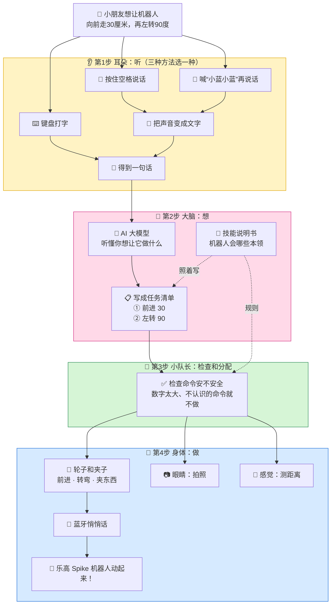

```mermaid
flowchart TD
    KID["🧒 小朋友想让机器人<br/>向前走30厘米，再左转90度"]

    subgraph EAR["👂 第1步 耳朵：听（三种方法选一种）"]
        KEY["⌨️ 键盘打字"]
        SPACE["🎤 按住空格说话"]
        WAKE["🔔 喊“小蓝小蓝”再说话"]
        STT["📝 把声音变成文字"]
        TEXT["💬 得到一句话"]
    end

    subgraph BRAIN["🧠 第2步 大脑：想"]
        LLM["🤖 AI 大模型<br/>听懂你想让它做什么"]
        BOOK["📖 技能说明书<br/>机器人会哪些本领"]
        PLAN["📋 写成任务清单<br/>① 前进 30<br/>② 左转 90"]
    end

    subgraph BOSS["👮 第3步 小队长：检查和分配"]
        CHECK["✅ 检查命令安不安全<br/>数字太大、不认识的命令就不做"]
    end

    subgraph BODY["🦾 第4步 身体：做"]
        MOVE["🚗 轮子和夹子<br/>前进 · 转弯 · 夹东西"]
        CAM["📷 眼睛：拍照"]
        SENSOR["📏 感觉：测距离"]
        BT["📡 蓝牙悄悄话"]
        HUB["🧱 乐高 Spike 机器人动起来！"]
    end

    KID --> KEY
    KID --> SPACE
    KID --> WAKE
    SPACE --> STT
    WAKE --> STT
    KEY --> TEXT
    STT --> TEXT

    TEXT --> LLM
    LLM --> PLAN
    BOOK -. 照着写 .-> PLAN
    BOOK -. 规则 .-> CHECK
    PLAN --> CHECK

    CHECK --> MOVE
    CHECK --> CAM
    CHECK --> SENSOR
    MOVE --> BT --> HUB

    style EAR fill:#FFF3C4,stroke:#E0A800
    style BRAIN fill:#FFD9E8,stroke:#D63384
    style BOSS fill:#D6F5D6,stroke:#2E8B57
    style BODY fill:#D6EAFF,stroke:#1E6FD9
```
