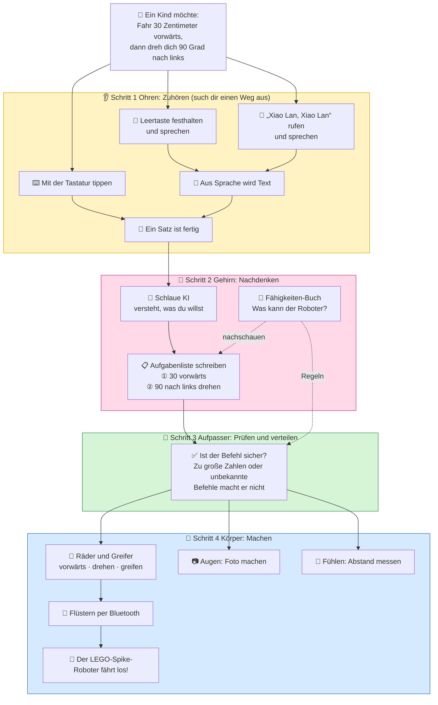

```mermaid
flowchart TD
    KID["🧒 Ein Kind möchte:<br/>Fahr 30 Zentimeter vorwärts,<br/>dann dreh dich 90 Grad nach links"]

    subgraph EAR["👂 Schritt 1 Ohren: Zuhören (such dir einen Weg aus)"]
        KEY["⌨️ Mit der Tastatur tippen"]
        SPACE["🎤 Leertaste festhalten<br/>und sprechen"]
        WAKE["🔔 „Xiao Lan, Xiao Lan“ rufen<br/>und sprechen"]
        STT["📝 Aus Sprache wird Text"]
        TEXT["💬 Ein Satz ist fertig"]
    end

    subgraph BRAIN["🧠 Schritt 2 Gehirn: Nachdenken"]
        LLM["🤖 Schlaue KI<br/>versteht, was du willst"]
        BOOK["📖 Fähigkeiten-Buch<br/>Was kann der Roboter?"]
        PLAN["📋 Aufgabenliste schreiben<br/>① 30 vorwärts<br/>② 90 nach links drehen"]
    end

    subgraph BOSS["👮 Schritt 3 Aufpasser: Prüfen und verteilen"]
        CHECK["✅ Ist der Befehl sicher?<br/>Zu große Zahlen oder unbekannte<br/>Befehle macht er nicht"]
    end

    subgraph BODY["🦾 Schritt 4 Körper: Machen"]
        MOVE["🚗 Räder und Greifer<br/>vorwärts · drehen · greifen"]
        CAM["📷 Augen: Foto machen"]
        SENSOR["📏 Fühlen: Abstand messen"]
        BT["📡 Flüstern per Bluetooth"]
        HUB["🧱 Der LEGO-Spike-Roboter fährt los!"]
    end

    KID --> KEY
    KID --> SPACE
    KID --> WAKE
    SPACE --> STT
    WAKE --> STT
    KEY --> TEXT
    STT --> TEXT

    TEXT --> LLM
    LLM --> PLAN
    BOOK -. nachschauen .-> PLAN
    BOOK -. Regeln .-> CHECK
    PLAN --> CHECK

    CHECK --> MOVE
    CHECK --> CAM
    CHECK --> SENSOR
    MOVE --> BT --> HUB

    style EAR fill:#FFF3C4,stroke:#E0A800
    style BRAIN fill:#FFD9E8,stroke:#D63384
    style BOSS fill:#D6F5D6,stroke:#2E8B57
    style BODY fill:#D6EAFF,stroke:#1E6FD9
```
